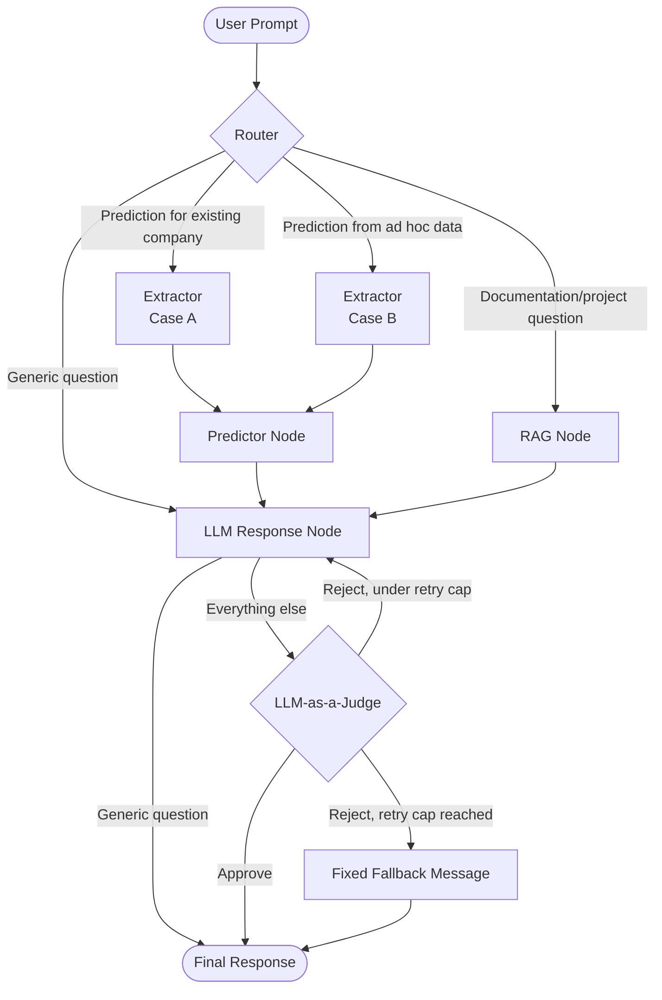

# Enterprise Credit Default Pipeline & GenAI Analyst

An end-to-end, production-grade MLOps and Data Engineering pipeline designed to predict credit default on highly imbalanced financial and transactional data. Features a decoupled storage architecture, automated experiment tracking, perimetric data validation, and a Generative AI assistant agent integrated with Explainable AI (xAI) metrics.

---

## 🚧 Project Status & Roadmap

This project is actively developed to simulate an enterprise-grade AI infrastructure deployment. 

* **[x] Phase 1:** Infrastructure Setup (Docker, PostgreSQL, GitHub Actions).
* **[x] Phase 2:** OLTP Core Banking Database Setup & Schema Design (SQLAlchemy ORM + Alembic Migrations).
* **[x] Phase 3:** MLOps Data Versioning (DVC Data Tracking) & OLAP Warehouse Transformation (dbt Core, Star Schema).
* **[x] Phase 4:** Machine Learning Benchmark Suite (Sklearn, XGBoost, PyTorch) & Experiment Tracking (MLflow).
* **[x] Phase 5:** Explainable AI (SHAP) Integration & Agentic GenAI Layer (LangGraph + ChromaDB).
* **[ ] Phase 6:** Production Exposure (FastAPI App) & Live Monitoring/Observability UI (Streamlit + Pydantic + Logfire).

---

## 🏗️ System Architecture

The system is engineered using a strictly decoupled, multi-layered architecture to process data securely from ingestion to intelligent, explainable inference:

1. **Transactional Layer (OLTP):** Containerized PostgreSQL instance simulating a production core-banking system managed via SQLAlchemy ORM and tracked through Alembic migrations.
2. **Analytical Layer (OLAP):** Dimensional Data Warehouse modeled into a Star Schema driven by dbt Core over historical immutable ledgers.
3. **MLOps & Lifecyle Layer:** Data version control implemented with DVC. Multi-model training pipeline (a cost-sensitive baseline, Gradient Boosted Trees, and a PyTorch Neural Network) integrated with MLflow for artifact logging, hyperparameter tracking, and model registry.
4. **Explainable AI (xAI) Module:** Interpretability extraction utilizing SHAP to ensure credit scoring compliance and transparency.
5. **Generative AI Layer:** An agent system built via LangGraph acting as an autonomous financial analyst, querying a ChromaDB vector store, running local inference, and validated by an LLM-as-a-Judge node.
6. **Application & Serving Layer:** A FastAPI backend exposing validated REST endpoints for predictions and chat interactions, paired with a Streamlit interface acting as a live, interactive demo of the full pipeline.

---

## 🤖 Agent Graph

The Generative AI layer is built as an explicit LangGraph state machine. A router node classifies every incoming request into one of four routes; all four converge on a shared LLM response node. The two prediction routes (existing or ad hoc company) both pass through a shared extraction and prediction step first. A generic, unrouted question skips validation entirely and returns directly; every other response is checked by an LLM-as-a-Judge node, which can send it back to be regenerated up to a fixed retry cap, past which a static fallback message is returned instead:



---

## 💬 Try the Agent

Ready-to-use example prompts for every route the agent handles — no need to guess a valid ad hoc company profile or which companies exist in the database — are available under [`docs/prompts/`](docs/prompts/), in both Italian and English. Run the agent with:

```bash
uv run python -m agent.run_agent
```

---

## 🚀 Try the API

The same agent and model are also served over HTTP, alongside two direct, LLM-independent prediction endpoints. Start the server with:

```bash
uv run uvicorn api.main:app --reload
```

Then browse the interactive, auto-generated documentation at [`http://localhost:8000/docs`](http://localhost:8000/docs) (Swagger UI, supports sending real requests directly from the browser) or [`http://localhost:8000/redoc`](http://localhost:8000/redoc), or exercise the endpoints directly with `curl`. The example company used below, `"Sistemi Tamburello S.r.l."`, is part of the seeded database.

⚠️ The commands below pipe the response through `jq` for pretty-printed JSON. Install it first (`sudo apt install jq` / `brew install jq`), or drop `| jq` from any command to see the raw response instead.

```bash
# Health check
curl http://localhost:8000/health | jq

# Chat - first turn, no Session-Id header yet
curl -X POST http://localhost:8000/chat \
  -H "Content-Type: application/json" \
  -d '{"message": "Qual è il rischio di insolvenza di Sistemi Tamburello S.r.l.?"}' | jq

# Chat - reuse the session_id returned above to continue the conversation
curl -X POST http://localhost:8000/chat \
  -H "Content-Type: application/json" \
  -H "Session-Id: <session_id from the previous response>" \
  -d '{"message": "Quali sono le ragioni principali che hanno portato a questa predizione?"}' | jq

# Direct prediction on ad hoc data (not in the database)
curl -X POST http://localhost:8000/predict/ad-hoc \
  -H "Content-Type: application/json" \
  -d '{
    "unpaid_ratio_trailing_90d": 0.15,
    "total_outstanding_debt": 12000,
    "foundation_date": "2015-03-01",
    "industry_sector": "manufacturing",
    "registered_office_region": "Lazio"
  }' | jq

# Direct prediction on an existing company, looked up by legal name or VAT number
curl -X POST http://localhost:8000/predict/company \
  -H "Content-Type: application/json" \
  -d '{"identifier": "Sistemi Tamburello S.r.l."}' | jq
```

---

## 🖥️ Try the UI

A Streamlit interface wraps the conversational endpoint for terminal-free, non-technical use: a sidebar lists past conversations from the current browser session, and the main panel renders the agent's Markdown-formatted answers instead of raw text. Only `/chat` is surfaced here; direct prediction (`/predict/ad-hoc`, `/predict/company`) targets callers who already have structured data and are expected to use the API directly, as shown above.

With the API still running (see [Try the API](#-try-the-api) above), start the UI in a separate terminal:

```bash
uv run streamlit run ui/app.py
```

It opens at [`http://localhost:8501`](http://localhost:8501) by default.

---

## 🧠 Architectural Decisions & Rationale


#### Modern Python Tooling (`uv` + Ruff)
* **Choice:** Moving away from standard `pip`/`venv` and selecting `uv` as the exclusive dependency manager alongside Ruff for quality gating.
* **Justification:** `uv` provides blazing-fast environment synchronization and strict, deterministic lockfile management, eliminating the "it works on my machine" anti-pattern in production containers. Ruff guarantees lightning-fast code linting and formatting compliance natively during pre-commit and CI stages.
 
#### Complete Isolation of OLTP and OLAP Store
* **Choice:** Running an analytical dbt layer over isolated analytical tables instead of running feature engineering queries straight against live application tables.
* **Justification:** Aggregation queries on production ledgers introduce lock contention and severely degrade user experience. Isolating data access ensures transactional low-latency uptime while enabling heavy-duty relational processing inside an optimized data warehouse.

#### Feature Engineering Delegated to the Analytical Layer
* **Choice:** Performing the heavy feature engineering (trailing-window aggregations, as-of temporal joins, SCD2 resolution) inside dbt/SQL, keeping the Python ML layer focused on feature *preparation* (encoding, imputation, scaling) rather than feature *engineering*.
* **Justification:** Keeping a single source of truth for business logic in SQL/dbt — already covered by dedicated data-quality and leakage tests — avoids duplicating transformation logic across languages and reduces the risk of training/serving skew.

#### Temporal Integrity as a First-Class Constraint
* **Choice:** Treating the feature mart as panel data (one row per company per snapshot date) and designing every split, validation, and dimension-resolution strategy around a point-in-time cutoff instead of random shuffling.
* **Justification:** Credit risk data is inherently sequential. A random split would leak future information into training and produce metrics that look strong but collapse in production; SCD Type 2 dimensions and as-of joins ensure that every feature reflects only information that was actually available at the snapshot date.

#### Trailing DPD Window Fix (Data Quality)
* **Choice:** Widened the 90-day trailing window used by `int_billing_trailing_90d` to select candidate invoices to 120 days, without changing the underlying days-past-due calculation.
* **Justification:** While validating the ML feature set end-to-end, the original 90-day window was found to systematically exclude unpaid invoices right before their days-past-due value could reach the 90-day insolvency threshold, silently producing zero labeled insolvencies across the entire mart. 120 days is the minimum window that reliably captures the threshold under monthly snapshots.

#### Near-Leakage Feature Removal (Data Quality)
* **Choice:** Removed `avg_dpd_trailing_90d` from the training feature set entirely, after it was found responsible for most of a suspiciously high test-set AUC-PR.
* **Justification:** An AUC-PR of 0.988 (XGBoost) prompted a targeted investigation rather than acceptance at face value. Removing the feature alone dropped AUC-PR to 0.691 (XGBoost), 0.633 (baseline), and 0.499 (MLP) — a consistent drop across all three model families — confirming it was strongly correlated (Pearson 0.80) with the deterministic label-generating column `max_dpd_trailing_90d` and was dominating the shared predictive signal rather than the models learning it independently.

#### Informative Missing Values over Blind Imputation or Row Dropping
* **Choice:** Nullable feature groups (financial statement ratios, login activity, support ticket satisfaction) are handled with a per-group binary flag marking whether the value was observed, followed by a group-specific fallback constant, rather than dropping incomplete rows or imputing with a statistical average.
* **Justification:** A diagnostic query showed that a naive `dropna` would have discarded roughly 77% of the dataset, disproportionately removing companies with no recent support tickets — a systematic selection bias, not a random one. The missingness itself is informative (e.g. no resolved tickets recently, no published financial statement yet), so it is preserved as a signal instead of being discarded or disguised as an invented average.

#### Size-Weighted Cross-Validation Metric Aggregation
* **Choice:** Aggregating per-fold validation metrics with a mean weighted by each fold's validation set size, while confusion matrix counts (true/false positives/negatives) are summed rather than averaged.
* **Justification:** `TimeSeriesSplit`'s expanding window produces folds of unequal size, so an unweighted mean would give a small, less reliable early fold the same influence as a large, more reliable later one. Confusion matrix counts are absolute quantities tied to fold size; averaging them (weighted or not) yields a number with no clear interpretation, while summing preserves their meaning as a total across the full cross-validation run, since each row is scored exactly once.

#### Structural Typing over a Shared Model Base Class
* **Choice:** Defining an `Estimator` structural protocol (`fit`/`predict_proba`) that scikit-learn estimators and a custom PyTorch wrapper both satisfy implicitly, rather than forcing a shared base class or inheritance hierarchy across model families.
* **Justification:** scikit-learn and PyTorch models have fundamentally different internals (a declarative `.fit()` call versus a manual training loop); requiring a common base class would either constrain scikit-learn's own class hierarchy or force an artificial wrapper on it. Structural typing lets the training orchestrator depend only on the shape of the interface, keeping both model families and the orchestrator itself decoupled from one another.

#### F2-Optimal Decision Threshold per Model Family
* **Choice:** Instead of using the default 0.5 probability cutoff to convert predicted probabilities into a binary class, each model family's decision threshold is separately tuned by maximizing the F2-score on the aggregated cross-validation folds (computed in `evaluation/plots.ipynb`), then wired into the final training run.
* **Justification:** Under substantial class imbalance (~16% positive rate), 0.5 is an arbitrary cutoff with no particular statistical justification, and each model family produces probabilities on a different scale. F2 weighs recall more heavily than precision, appropriate for insolvency prediction where missing an actual default is costlier than a false alarm; tuning it per model family, rather than sharing one global threshold, respects each family's own calibration instead of forcing a shared assumption onto all three.

#### Manual Hyperparameter Tuning via Shell Scripts
* **Choice:** Hyperparameter search is performed as a manual grid search driven by dedicated shell scripts under `ml/tuning/scripts/`, one per model family (plus a narrower `fine_tune_xgb.sh` second pass for XGBoost, once the full grid pointed to a promising region). Each script temporarily patches the relevant defaults via `sed`, runs the training pipeline for that combination, and appends the resulting cross-validation metrics to a CSV under `ml/tuning/results/`, keeping full per-run logs under `ml/tuning/logs/`. The original files are always restored on exit (success, failure, or interruption).
* **Justification:** With only 2-3 hyperparameters explored per model family, a manual grid search keeps the process reproducible and inspectable without adding a new dependency or learning curve. A shared quirk had to be worked around: `setup_logging()` registers both a plain `StreamHandler` and Logfire's handler, and Logfire also echoes the same line to stdout independently, so each log line is captured twice, the parsing step takes only the first occurrence to avoid corrupting the results CSV.

#### SHAP-Driven Input Validation for Ad Hoc Predictions
* **Choice:** XGBoost is the only model family explained via SHAP (`ml/evaluation/explainability.py`, built on `TreeExplainer`), since only the best-performing model is ever deployed, and prior benchmarking already pointed to XGBoost, investing explainability effort in the baseline or MLP would not translate into production value. That same SHAP analysis (see the beeswarm plot in `ml/evaluation/plots.ipynb`) directly drives which fields are required versus optional in the `InsolvencyPredictionRequest` Pydantic schema used to validate ad hoc predictions for companies not yet in the database: the two dominant features (`unpaid_ratio_trailing_90d`, `total_outstanding_debt`) are mandatory, while the rest are optional and left as NaN when omitted.
* **Justification:** This ties the validation layer's strictness to actual, measured feature importance rather than an arbitrary judgment call about which fields "feel" necessary, and lets XGBoost's native missing-value handling (the model is trained with `handle_nan=False`) degrade gracefully on the fields it relies on least.

#### Router-First Agent Design
* **Choice:** The agent's graph classifies every incoming request into one of four explicit routes (`case_a`, `case_b`, `rag`, `direct`) before any downstream node runs. The alternative considered was invoking retrieval unconditionally on every request and relying on a low similarity score to fall back to a direct answer when nothing relevant came back.
* **Justification:** Retrieval is not free: every ChromaDB query adds latency and risks injecting irrelevant context into the prompt for requests that don't need it (e.g. a greeting or an out-of-scope question). An explicit router keeps each path in the graph doing only the work it actually needs, at the cost of depending on the router's own classification accuracy.

#### Single Source of Truth for the Agent's Routing Type
* **Choice:** The `Literal` of valid routes is defined once, as `AgentRoute` in `schemas/agent/types.py`, and reused both by `RouterDecision` (the schema constraining the router LLM's structured output) and by `AgentState.route` (the graph's own state). The router's LLM output is validated against `RouterDecision` alone rather than the full `AgentState`, keeping the model's output surface limited to the one field it is actually responsible for producing.
* **Justification:** The two schemas serve different purposes — one shapes what the LLM is allowed to return, the other is the graph's source of truth — but they must always agree on the same set of valid routes. Defining that set once and importing it in both places removes the possibility of the two drifting out of sync if a new route is ever added.

#### Groq as the LLM Hosting Provider (`openai/gpt-oss-120b`)
* **Choice:** The agent's LLM calls are served via Groq, currently using `openai/gpt-oss-120b`, rather than a locally self-hosted open-weight model.
* **Justification:** The project's local hardware is CPU-only, ruling out running a model of this size directly. Groq offers a genuinely free tier (no credit card required) with low-latency inference over open-weight models, making it a better fit than a smaller, locally runnable model that would trade off response quality.

#### Extraction, Not Query or Feature Generation
* **Choice:** The extractor node never lets the LLM produce SQL or a ready-to-use feature DataFrame. For case_a, the LLM only extracts free-text company identifiers (legal name or VAT number) via structured output; resolving an identifier into a `company_id` is done by a parameterized, code-written query, never a query the model itself constructs. For case_b, the LLM extracts data into a deliberately permissive intermediate schema, every field optional and unconstrained, which is then validated for real against `InsolvencyPredictionRequest`; a validation failure is recorded rather than raised, so the responder node can explain to the user what is missing or invalid.
* **Justification:** Letting an LLM generate SQL from free text opens the door to injection-shaped risk that has nothing to do with a malicious user, an LLM producing a malformed or unsafe query is enough. Separating "what did the user say" (the LLM's job) from "is it enough, and is it valid" (`InsolvencyPredictionRequest`'s job) also prevents an LLM extraction quirk, such as defaulting an unstated qualitative claim ("heavily indebted") to an invented number, from silently masquerading as real user-supplied data feeding a financial prediction model.

#### Single Source of Truth for the Decision Threshold
* **Choice:** `predict` and `predict_from_raw_data` no longer accept a `threshold` parameter from the caller; both always score against `loaded_model.threshold`, read directly from the `selected_threshold` MLflow param logged on the final training run (see `evaluation/plots.ipynb`) when the model bundle is loaded.
* **Justification:** With `threshold` as a separate caller-supplied argument, nothing prevented a prediction from being scored against a threshold inconsistent with the one the model was actually tuned against. Centralizing it inside the loaded model bundle removes that possibility entirely, at the cost of `load_model` failing fast if a run has no threshold logged, a deliberate trade-off, given a run without one isn't ready to serve predictions in the first place.

#### Documentation Extraction via AST/YAML, Never Import
* **Choice:** `extract_docs.py` reads every Python docstring and dbt model/column description directly from source text (`ast` for `.py` files, `yaml` for `schema.yml`), rather than importing project modules to read `__doc__` via `inspect`.
* **Justification:** Several modules open real side effects at import time (e.g. a database connection) or pull in heavy dependencies (PyTorch, XGBoost) not needed just to read a docstring; parsing source text avoids triggering any of that.

#### Idempotent RAG Ingestion
* **Choice:** `ingest.py` deletes and recreates the ChromaDB collection on every run, rather than only upserting new chunks into it.
* **Justification:** `upsert` alone would leave a chunk orphaned in the index forever once its source (a deleted README section, a removed docstring) disappears. Starting from a clean collection each time means re-running ingestion after any documentation change is always safe, with no manual cleanup step.

#### Format-Matched Context Injection in the Responder
* **Choice:** The responder node formats the material it injects into the prompt differently depending on its shape, not uniformly as plain text: prediction results/errors (case_a, case_b) are minimal JSON wrapped in an XML-style tag, while retrieved context (rag) is plain text in its own tag.
* **Justification:** Prediction results are multi-field numeric records the model must cite precisely without mixing up figures across companies or fields, exactly the case where a keyed format outperforms prose; retrieved context is prose the model should synthesize freely, where a keyed format would only add syntactic noise. Prompt format affects an LLM's reasoning mode, not just output structure, so the format is chosen per material rather than fixed for the whole prompt.

#### Retry on a Known Groq/gpt-oss Flakiness
* **Choice:** `agent/utils/llm_utils.py`'s `invoke_with_retry` retries a structured-output LLM call when Groq returns `tool_use_failed` (`openai/gpt-oss-*` intermittently responding with plain text instead of the required tool call under `tool_choice="required"`), rather than letting it crash the graph. The judge node uses a higher retry cap than the router/extractor, given its longer, denser prompts; if every attempt is still exhausted, the response is treated as approved by default (logged as a warning) rather than surfacing a raw error to the user.
* **Justification:** This failure is documented independently across Groq's own community forum and the LangChain/pydantic-ai issue trackers as a provider/model-level flakiness, not a sign of a malformed prompt or schema, so a short retry resolves it in practice. Defaulting to approved on total exhaustion, rather than failing the whole request, reflects that the user has otherwise already received a valid response from the responder in every case observed, an unverifiable verdict is a worse outcome for them than an unverified one.

#### Feature Order and Presence Validated Against the Model Itself
* **Choice:** `score_features` reorders the scored DataFrame's columns to `loaded_model.model.feature_names_in_` before calling `predict_proba`, instead of relying on `retrieve_company_data`'s query or `predict_from_raw_data`'s hand-written dict to already match the order used in training.
* **Justification:** XGBoost's `inplace_predict` validates column order, not just column names, and neither entry point's own construction order was guaranteed to match it — reading the order from the model itself removes that assumption entirely. Exercising the pipeline against the real database and model (rather than only mocked tests) surfaced two related gaps fixed the same way: `retrieve_company_data` was including the target column (`is_insolvent`) among the model's input features, and `predict_from_raw_data` never derived `year`/`quarter`/`month` at all, despite them being required training features.

#### Canonical Company Name Propagated Through Predictions
* **Choice:** `predict` reads the company's canonical `legal_name` from the scored DataFrame's index and includes it in `PredictionResult` as `company_name` (`None` for case_b, which has no database record to draw one from). The responder's prompt material also includes a `company_identifiers` block with the user's original free-text wording.
* **Justification:** Without this, the responder had only an opaque `company_id` to work with and no textual link back to the name the user actually asked about — a gap invisible in isolated testing but immediately apparent the first time a real request paraphrased a company's name rather than repeating it verbatim.

#### API Surface Kept Deliberately Small
* **Choice:** The API exposes only two endpoint areas: `POST /chat`, routed through the agent, and two direct prediction endpoints (`POST /predict/ad-hoc`, `POST /predict/company`) that call directly into `ml.inference.predictor`. It exposes no endpoint to query the OLTP database or the OLAP star schema directly.
* **Justification:** The database and the datamart are implementation details of how the agent and the model produce an answer, not something an end user needs, or should be able to, query on their own. Keeping the public surface limited to a conversational entry point and a direct scoring path avoids turning a portfolio inference service into a general-purpose database query API, which was never the goal.

#### `/predict/ad-hoc` and `/predict/company` as Separate Endpoints, Not One Branching Internally
* **Choice:** The direct prediction area exposes two distinct routes, `POST /predict/ad-hoc` (a fully-specified profile not in the database, `InsolvencyPredictionRequest` + `predict_from_raw_data`) and `POST /predict/company` (an existing company, `ExistingCompanyRequest` + `predict`), rather than a single `/predict` endpoint that inspects the request body to decide which case applies.
* **Justification:** This mirrors the case_a/case_b distinction already used throughout the rest of the project (extractor, predictor, SHAP), rather than reintroducing it as an implicit branch at the HTTP layer. The two also fail differently in ways that are easier to reason about as separate routes: `/predict/company` can 404 on an identifier that resolves to nothing, a case that does not exist for `/predict/ad-hoc`, which is always a valid, if hypothetical, scoring request as long as it passes Pydantic validation.

#### No Internal Database ID Ever Exposed to the Client
* **Choice:** `POST /predict/company` accepts a company's legal name or VAT number as `identifier`, resolved to a `company_id` server-side via a parameterized query; that `company_id` is never returned in `PredictionResponse`, which carries `company_name` but not `company_id`.
* **Justification:** A surrogate database key is an implementation detail of the star schema, not a piece of information the caller supplied or has any independent way to obtain, since no endpoint exists to look one up. Returning it would expose an internal identifier with no actionable use on the client side, the same reasoning that kept the OLTP/OLAP schema unexposed in the first place.

#### Agent and Model Built Once at Startup, Not Per-Request
* **Choice:** `agent.graph.build_agent()` and `ml.inference.model_loader.load_model()` are never called inside a request handler. The compiled agent is built once in FastAPI's `lifespan` and stored on `app.state.agent`; the loaded model bundle is built once via `@cache` on `api.dependencies.get_loaded_model`, mirroring the same pattern already used by the agent's own predictor node.
* **Justification:** Both are expensive to construct, wiring together every node of the graph, or loading a full MLflow model bundle. Rebuilding either on every request would add unnecessary latency and load to every single call; building once and reusing the result across requests, injected via `Depends`, keeps that cost off the request path entirely.

#### Per-Session Conversation History, Not a Global List
* **Choice:** `api/session_store.py` keys conversation history by a client-supplied `session_id` (sent via a `Session-Id` header, generated server-side and echoed back when the client sends none), rather than keeping a single global list the way the CLI (`agent/run_agent.py`) does.
* **Justification:** The CLI's single in-memory list is only valid because it serves one user, one conversation, at a time. An HTTP server is stateless between requests and may serve several concurrent users (multiple browser tabs against the same Streamlit instance, for example), so history has to be isolated per conversation rather than shared globally. Storage is a plain in-memory dict rather than a persistent store: state is lost on restart and isn't shared across replicas, an accepted limitation for a no-cloud v1.

#### Shared Company-Resolution Query, Not Duplicated Between the Agent and the API
* **Choice:** The parameterized query that resolves a free-text company identifier (legal name or VAT number) into a `company_id` lives in `utils/queries.py`, imported both by the agent's `extract_case_a` and by `POST /predict/company`, rather than being duplicated or imported by the API from `agent/nodes/`.
* **Justification:** The two call sites need the exact same resolution logic, so duplicating it would risk the two drifting out of sync if the query ever changed. Importing it from `agent/nodes/` instead would couple the API to the agent's own node package for a single SQL constant, pulling in module-level dependencies (LLM prompts, LangChain imports) the API has no reason to depend on.

#### The UI Only Exposes `/chat`, Never `/predict/*` Directly
* **Choice:** `ui/app.py` talks to the API exclusively through `POST /chat` and `GET /chat/{session_id}/history`. It never calls `/predict/ad-hoc` or `/predict/company`.
* **Justification:** Anyone with structured data ready for a direct prediction endpoint already knows how to make an HTTP call, documented above under Try the API; the UI's purpose is to make the conversational agent usable without a terminal, not to duplicate the direct prediction path behind a form.

#### A Client-Side Conversation Registry, Not a Server-Side One
* **Choice:** `ui/chat_registry.py` keeps a lightweight, `st.session_state`-backed index of the `session_id`s known to the current browser session, each with a short preview generated from its first user message, so the sidebar can list past conversations. Only the identifier and preview live here; the full message history is never duplicated client-side, and is instead read back from `GET /chat/{session_id}/history` whenever the user switches to a past conversation.
* **Justification:** `api/session_store.py` is already the single source of truth for conversation history; keeping a second, client-side copy risks the two drifting apart (e.g. after a server restart, which clears server-side history but would leave stale messages behind client-side). Storage in `st.session_state` is scoped to a single browser tab and lost when it closes, the same in-memory, no-cloud limitation already accepted for `SessionStore` on the API side.

#### `mlruns/` and `mlflow.db` Are Bind-Mounted, Not Baked Into the API Image
* **Choice:** `docker-compose.yml` mounts the host's existing MLflow tracking DB and artifact store into the `api` container at the same relative path the API's `WORKDIR` expects, rather than copying them into the image at build time or retraining inside the container on every startup.
* **Justification:** Producing them is a prerequisite of running the containerized stack, the same as filling in `.env`: `docker compose up` orchestrates the already-trained project, it doesn't (re)train it. Bind-mounting also means a freshly retrained model becomes visible to the API on a restart, without rebuilding the image, and keeps the (potentially large) artifacts out of the image itself.

#### The Retry Loop Now Actually Feeds the Judge's Feedback Back In
* **Choice:** `responder_node` reads `judge_verdict` on every call and, when it holds a rejection, injects its `reason` into the next attempt as an explicit `<correction_needed>` hint, rather than regenerating from the same prompt it used before.
* **Justification:** Previously, only `graph.py` ever read `judge_verdict`, to decide whether to loop back to the responder at all — the responder itself never saw *why* the judge had rejected its answer, so every retry regenerated essentially the same response and was rejected again for the same reason, exhausting the retry budget and falling through to the fallback message even when the underlying issue was fixable. This was already the intent recorded in `JudgeVerdict`'s own docstring, just never wired up.

#### Known Limitation: Cross-Lingual RAG Retrieval Is Unreliable
* **Choice:** No workaround (e.g. translating the query before embedding it, or switching to a larger multilingual embedding model) has been implemented for this v1; the limitation is documented rather than patched around.
* **Justification:** `all-MiniLM-L6-v2`, the local, CPU-only embedding model used for retrieval, was chosen for being free and requiring no network round-trip per query, at the cost of weaker cross-lingual alignment than a larger or API-hosted model would offer. In practice this means an Italian question about English-language project documentation (e.g. asking which ML model is used and how well it performs) can retrieve chunks with a much weaker semantic match than the same question asked in English, occasionally missing the relevant chunk entirely, an issue neither the responder's nor the judge's prompt can fix once the retriever has already returned the wrong context to work with. A larger or hosted multilingual embedding model would very likely resolve this, at the cost of the constraints that led to the current choice in the first place.

---

## 📊 Results
 
**XGBoost is the production model**, chosen after benchmarking it against a Logistic Regression baseline and a PyTorch MLP on the same final holdout test set (never seen during training, cross-validation, or hyperparameter tuning), each evaluated at its own F2-optimal decision threshold:

| Model | AUC-ROC | AUC-PR | Precision | Recall | F1 |
|---|---|---|---|---|---|
| Baseline (Logistic Regression) | 0.8742 | 0.5026 | 0.3911 | 0.9578 | 0.5555 |
| MLP (PyTorch) | 0.8890 | 0.6030 | 0.3838 | 1.0000 | 0.5547 |
| **XGBoost** | **0.9198** | **0.6951** | **0.4351** | **0.9794** | **0.6026** |

XGBoost is the strongest model on every metric except recall, where the MLP reaches a perfect 1.0. This is not attributable to a well-chosen decision threshold, the same result holds regardless of the threshold used, suggesting the MLP's predicted probabilities are clustered in a narrow, mostly-high range rather than genuinely separating the two classes. Combined with its lower AUC-ROC and AUC-PR, this points to weaker discrimination overall rather than superior performance. XGBoost is the model served in production, consistent with it being the only model family benchmarked and explained in depth (see the SHAP section below and `ml/evaluation/plots.ipynb`).

---

## 🛠️ Tech Stack

* **Infrastructure & DevOps:** Docker, Docker Compose, GitHub Actions (CI/CD)
* **Environment & Package Management:** Python, uv
* **Data Engineering & Storage:** PostgreSQL, SQLAlchemy, Alembic, dbt Core
* **Data Versioning:** DVC
* **Machine Learning Engines:** PyTorch, Scikit-Learn, XGBoost
* **Explainable AI (xAI):** SHAP
* **MLOps & Model Tracking:** MLflow
* **QA & Enterprise Validation:** Pytest, Pydantic Validation
* **Configuration Management:** Pydantic Settings
* **Observability & Logging:** Pydantic Logfire, Ruff
* **Generative AI Infrastructure:** LangGraph, ChromaDB, Groq
* **Application Layer & UI:** FastAPI, Streamlit

---

## 📂 Project Structure (up to this moment)

```text
insolvency_prediction_project/
├── .dvc/
│   ├── .gitignore
│   └── config
├── .github/
│   ├── workflows/
│   │   └── main.yml
│   └── pull_request_template.md
├── agent/
│   ├── models/
│   │   ├── __init__.py
│   │   ├── llm_judge.py
│   │   └── llm_responder.py
│   ├── nodes/
│   │   ├── __init__.py
│   │   ├── extractor.py
│   │   ├── judge.py
│   │   ├── predictor_node.py
│   │   ├── responder.py
│   │   ├── retriever_node.py
│   │   └── router.py
│   ├── prompts/
│   │   ├── __init__.py
│   │   ├── extractor_prompt.py
│   │   ├── judge_prompt.py
│   │   ├── responder_prompt.py
│   │   └── router_prompt.py
│   ├── rag/
│   │   ├── __init__.py
│   │   ├── extract_docs.py
│   │   ├── ingest.py
│   │   └── retrieval.py
│   ├── utils/
│   │   ├── __init__.py
│   │   └── llm_utils.py
│   ├── __init__.py
│   ├── graph.py
│   ├── run_agent.py
│   └── state.py
├── analytics/
│   ├── dbt_project/
│   │   ├── analyses
│   │   │   └── .gitkeep
│   │   ├── macros
│   │   │   └── generate_company_key.sql
│   │   ├── models/
│   │   │   ├── intermediate/
│   │   │   │   ├── int_billing_trailing_90d.sql
│   │   │   │   ├── int_companies_scd_resolved.sql
│   │   │   │   ├── int_company_date_spine.sql
│   │   │   │   ├── int_contracts_asof.sql
│   │   │   │   ├── int_financial_asof.sql
│   │   │   │   ├── int_insolvency_label.sql
│   │   │   │   ├── int_logins_trailing.sql
│   │   │   │   ├── int_tickets_trailing.sql
│   │   │   │   └── schema.yml
│   │   │   ├── marts/
│   │   │   │   ├── dim_companies.sql
│   │   │   │   ├── dim_date.sql
│   │   │   │   ├── fct_company_credit_profile.sql
│   │   │   │   └── schema.yml
│   │   │   └── staging/
│   │   │       ├── schema.yml
│   │   │       ├── sources.yml
│   │   │       ├── stg_companies.sql
│   │   │       ├── stg_crm_support_tickets.sql
│   │   │       ├── stg_energy_contracts.sql
│   │   │       ├── stg_financial_statements.sql
│   │   │       ├── stg_invoices.sql
│   │   │       ├── stg_payments.sql
│   │   │       └── stg_user_web_logins.sql
│   │   ├── seeds/
│   │   │   └── .gitkeep
│   │   ├── snapshots/
│   │   │   ├── companies_snapshot.sql
│   │   │   └── energy_contracts_snapshot.sql
│   │   ├── tests/
│   │   │   ├── intermediate/
│   │   │   │   ├── int_billing_trailing_90d/
│   │   │   │   │   ├── int_billing_trailing_90d_debt_ratio_match.sql
│   │   │   │   │   ├── int_billing_trailing_90d_dpd_consistency.sql
│   │   │   │   │   └── int_billing_trailing_90d_no_future_leakage.sql
│   │   │   │   ├── int_companies_scd_resolved/
│   │   │   │   │   ├── int_companies_scd_resolved_chronology.sql
│   │   │   │   │   ├── int_companies_scd_resolved_expired_versions.sql
│   │   │   │   │   └── int_companies_scd_resolved_leakage.sql
│   │   │   │   ├── int_company_date_spine/
│   │   │   │   │   ├── int_company_date_spine_no_dates_before_foundation.sql
│   │   │   │   │   ├── int_company_date_spine_no_future_dates.sql
│   │   │   │   │   ├── int_company_date_spine_np_gaps.sql
│   │   │   │   │   └── int_company_date_spine_respects_valid_to.sql
│   │   │   │   ├── int_contracts_asof/
│   │   │   │   │   ├── int_contracts_asof_count_flag_consistency.sql
│   │   │   │   │   └── int_contracts_asof_no_future_leakage.sql
│   │   │   │   ├── int_financial_asof/
│   │   │   │   │   ├── int_financial_asof_publication_delay_leakage.sql
│   │   │   │   │   └── int_financial_asof_rank_recency.sql
│   │   │   │   ├── int_insolvency_label/
│   │   │   │   │   ├── int_insolvency_label_false_negative.sql
│   │   │   │   │   └── int_insolvency_label_false_positive.sql
│   │   │   │   ├── int_logins_trailing/
│   │   │   │   │   ├── int_logins_trailing_null_consistency.sql
│   │   │   │   │   ├── int_logins_trailing_recency_boundary.sql
│   │   │   │   │   └── int_logins_trailing_velocity_coherence.sql
│   │   │   │   └── int_tickets_trailing_90d/
│   │   │   │       └── int_tickets_trailing_90d_no_future_leakage.sql
│   │   │   └── marts/
│   │   │       ├── dim_companies/
│   │   │       │   ├── dim_companies_no_overlapping_windows.sql
│   │   │       │   └── dim_companies_single_current_version.sql
│   │   │       ├── dim_date/
│   │   │       │   └── dim_date_no_gaps.sql
│   │   │       └── fct_company_credit_profile/
│   │   │           ├── fct_company_key_temporal_correctness.sql
│   │   │           ├── fct_no_dropped_spine_rows.sql
│   │   │           └── fct_no_unexpected_nulls.sql
│   │   ├── .envrc
│   │   ├── .envrc.example
│   │   ├── .gitignore
│   │   ├── dbt_project.yml
│   │   ├── package-lock.yml
│   │   ├── packages.yml
│   │   └── README.md
│   ├── ingestion/
│   │   ├── __init__.py
│   │   ├── extract.py
│   │   └── restore.py
│   └── __init__.py
├── api/ 
│   ├── routers/
│   │   ├── __init__.py
│   │   ├── chat.py
│   │   └── predict.py
│   ├── __init__.py
│   ├── dependencies.py
│   ├── main.py
│   └── session_store.py
├── data/
│   ├── .gitignore
│   └── raw.dvc
├── database/
│   ├── migrations/
│   │   ├── versions/
│   │   │   ├── 4c84a2bf5287_feat_create_database_structure.py
│   │   │   ├── 7f2797ec0404_feat_create_database_structure.py
│   │   │   └── c1cf595229f7_feat_create_database_structure_really_.py
│   │   ├── env.py
│   │   ├── README
│   │   └── script.py.mako
│   ├── __init__.py
│   ├── base.py
│   ├── connection.py
│   ├── credit-default-database.sql
│   ├── models.py
│   └── types.py
├── docs/
│   ├── images/
│   │   ├── credit-default-database.pdf
│   │   ├── credit-default-DFM.pdf
│   │   ├── credit-default-star-schema.pdf
│   │   └── dag-dbt.jpg
│   ├── prompts/
│   │   ├── case_a/
│   │   │   ├── case_a_en.md
│   │   │   └── case_a_it.md
│   │   ├── case_b/
│   │   │   ├── case_b_en.md
│   │   │   └── case_b_it.md
│   │   ├── direct/
│   │   │   ├── direct_en.md
│   │   │   └── direct_it.md
│   │   └── rag/
│   │       ├── rag_en.md
│   │       └── rag_it.md
│   └── schema/
│       ├── credit-default-DFM.sql
│       ├── credit-default-star-schema.sql
│       └── database_structure.sql
├── ml/
│   ├── dataset/
│   │   ├── __init__.py
│   │   ├── loader.py
│   │   ├── preprocessing.py
│   │   └── split.py
│   ├── evaluation/
│   │   ├── __init__.py
│   │   ├── explainability.py
│   │   ├── metrics.py
│   │   └── plots.ipynb
│   ├── inference/
│   │   ├── __init__.py
│   │   ├── model_loader.py
│   │   └── predictor.py
│   ├── models/
│   │   ├── __init__.py
│   │   ├── baseline.py
│   │   ├── mlp.py
│   │   ├── protocol.py
│   │   └── xgboost_model.py
│   ├── training/
│   │   ├── __init__.py
│   │   ├── mlflow_utils.py
│   │   └── trainer.py
│   ├── tuning/
│   │   ├── results/
│   │   │   ├── baseline_results.csv
│   │   │   ├── mlp_results.csv
│   │   │   ├── xgboost_fine_results.csv
│   │   │   └── xgboost_results.csv
│   │   └── scripts
│   │       ├── fine_tune_xgb.sh
│   │       ├── tune_baseline.sh
│   │       ├── tune_mlp.sh
│   │       └── tune_xgb.sh
│   ├── __init__.py
│   └── run_training.py
├── schemas/
│   ├── agent/
│   │   ├── __init__.py
│   │   ├── extraction_validation.py
│   │   ├── judge_validation.py
│   │   ├── route_validation.py
│   │   └── types.py
│   ├── api/ 
│   │   ├── routers/ 
│   │   │   ├── __init__.py
│   │   │   ├── chat.py
│   │   │   └── predict.py
│   │   ├── __init__.py
│   │   └── session_validation.py
│   ├── database/
│   │   ├── __init__.py
│   │   ├── base.py
│   │   ├── models_validation.py
│   │   └── types.py
│   ├── ml/
│   │   ├── __init__.py
│   │   └── insolvency_prediction.py
│   └── __init__.py
├── simulation/
│   ├── __init__.py
│   ├── profiles.py
│   └── seed.py
├── tests/
│   ├── agent/
│   │   ├── models/
│   │   │   ├── __init__.py
│   │   │   ├── test_llm_judge.py
│   │   │   └── test_llm_responder.py
│   │   ├── nodes/
│   │   │   ├── __init__.py
│   │   │   ├── test_extractor.py
│   │   │   ├── test_judge.py
│   │   │   ├── test_predictor_node.py
│   │   │   ├── test_responder.py
│   │   │   ├── test_retriever_node.py
│   │   │   └── test_router.py
│   │   ├── rag/
│   │   │   ├── __init__.py
│   │   │   ├── test_extract_docs.py
│   │   │   ├── test_ingest.py
│   │   │   └── test_retrieval.py
│   │   ├── utils
│   │   │   ├── __init__.py
│   │   │   └── test_llm_utils.py
│   │   ├── __init__.py
│   │   ├── test_graph.py
│   │   └── test_run_agent.py
│   ├── analytics/
│   │   ├── ingestion/
│   │   │   ├── __init__.py
│   │   │   ├── test_extract.py
│   │   │   └── test_restore.py
│   │   └── __init__.py
│   ├── api/
│   │   ├── routers/
│   │   │   ├── __init__.py
│   │   │   ├── test_chat.py
│   │   │   └── test_predict.py
│   │   ├── __init__.py
│   │   ├── test_dependencies.py
│   │   ├── test_main.py
│   │   └── test_session_store.py
│   ├── database/
│   │   ├── __init__.py
│   │   ├── test_connection.py
│   │   └── test_models.py
│   ├── ml/
│   │   ├── dataset/
│   │   │   ├── __init__.py
│   │   │   ├── test_loader.py
│   │   │   ├── test_preprocessing.py
│   │   │   └── test_split.py
│   │   ├── evaluation/
│   │   │   ├── __init__.py
│   │   │   ├── test_explainability.py
│   │   │   └── test_metrics.py
│   │   ├── inference/
│   │   │   ├── __init__.py
│   │   │   ├── test_model_loader.py
│   │   │   └── test_predictor.py
│   │   ├── models/
│   │   │   ├── __init__.py
│   │   │   ├── test_baseline.py
│   │   │   └── test_mlp.py
│   │   ├── training/
│   │   │   ├── __init__.py
│   │   │   └── test_trainer.py
│   │   ├── __init__.py
│   │   └── test_run_training.py
│   ├── schemas/
│   │   ├── database/
│   │   │   ├── __init__.py
│   │   │   └── test_models_validation.py
│   │   ├── ml/
│   │   │   ├── __init__.py
│   │   │   └── test_insolvency_prediction.py
│   │   └── __init__.py
│   ├── simulation/
│   │   ├── __init__.py
│   │   └── test_seed.py
│   ├── ui/
│   │   ├── __init__.py
│   │   ├── test_app.py
│   │   ├── test_chat_registry.py
│   │   └── test_client.py
│   ├── utils/
│   │   ├── __init__.py
│   │   ├── test_date_validation.py
│   │   └── test_timezone_utils.py
│   ├── __init__.py
│   └── conftest.py
├── ui/
│   ├── __init__.py
│   ├── app.py
│   ├── chat_registry.py
│   └── client.py 
├── utils/
│   ├── __init__.py
│   ├── date_validation.py
│   ├── logging_utils.py
│   ├── queries.py
│   └── timezone_utils.py
├── .dvcignore
├── .env
├── .env.example
├── .gitignore
├── .python-version
├── alembic.ini
├── config.py
├── docker-compose.yml
├── Dockerfile.api
├── Dockerfile.ui
├── LICENSE
├── pyproject.toml
├── README.md
└── uv.lock
```
